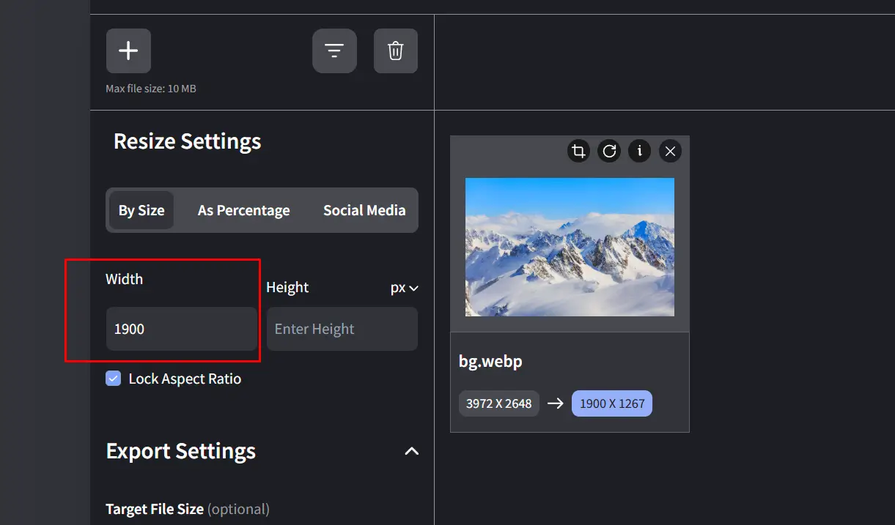
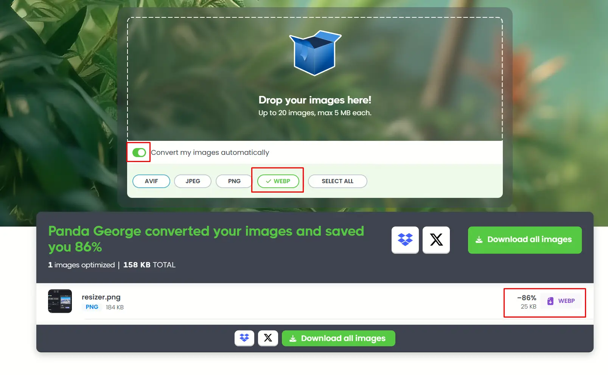

# Návod na obsluhu stránek AKA Praha

## Jak přidat nový obsah

### Kam ukládat soubory

| Typ obsahu | Složka |
|------------|--------|
| Akce | `_posts/event/` |
| Deníček | `_posts/article/diary/` |
| Metodika | `_posts/article/methodology/` |
| Popis oblasti | `_posts/article/area/` |
| Z klubu | `_posts/article/club/` |
| Galerie | `_posts/gallery/` |

### Pojmenování souboru

Vždy: `RRRR-MM-DD-nazev-bez-diakritiky.md`

Příklad: `2025-01-17-zimni-tatry.md`

### Postup ve VS Code

1. Otevři složku projektu
2. Vytvoř nový soubor ve správné složce
3. Zkopíruj šablonu (viz níže) a uprav
4. Ulož soubor (Ctrl+S)
5. Vlevo klikni na ikonu "Source Control" (větvička)
6. Napiš krátký popis změny (např. "Nový článek Zimní Tatry")
7. Klikni "Commit" a pak "Sync Changes"
8. Počkej 2-3 minuty – web se automaticky aktualizuje

---

## Šablony

### Akce (event)

```yaml
---
categories: [content, event]
permalink: /akce/nazev-akce/
title: "Název akce"
date_begin: 2025-01-20
date_end: 2025-01-22
author: "Tvoje Jméno"
image: /images/2025-01/obrazek.webp
---

Text akce...
```

### Deníček (diary)

```yaml
---
categories: [content, article, diary]
permalink: /clanky/denicek/nazev-clanku/
title: "Název deníčku"
date_created: 2025-01-17
author: "Tvoje Jméno"
image: /images/2025-01/obrazek.webp
---

Text deníčku...
```

### Metodika (methodology)

```yaml
---
categories: [content, article, methodology]
permalink: /clanky/metodika/nazev-clanku/
title: "Název metodiky"
date_created: 2025-01-17
author: "Tvoje Jméno"
image: /images/2025-01/obrazek.webp
---

Text metodiky...
```

### Popis oblasti (area)

```yaml
---
categories: [content, article, area]
permalink: /clanky/oblasti/nazev-oblasti/
title: "Název oblasti"
date_created: 2025-01-17
author: "Tvoje Jméno"
---

Text popisu oblasti...
```

### Z klubu (club)

```yaml
---
categories: [content, article, club]
permalink: /clanky/klub/nazev-clanku/
title: "Název článku"
date_created: 2025-01-17
author: "Tvoje Jméno"
image: /images/2025-01/obrazek.webp
---

Text článku...
```

### Galerie (gallery)

```yaml
---
layout: album
categories: [gallery]
permalink: /galerie/nazev-alba/
title: "Název alba"
cover: /images/2025-01/titulni-foto.webp
groups:
  - name: Název skupiny fotek
    photos:
      - /images/2025-01/foto1.webp
      - /images/2025-01/foto2.webp
      - /images/2025-01/foto3.webp
  - name: Další skupina
    photos:
      - /images/2025-01/foto4.webp
---
```

**Poznámky k šablonám:**
- `image:` je nepovinné – bez něj se zobrazí logo AKA
- `permalink:` musí odpovídat názvu souboru (bez diakritiky, pomlčky místo mezer)
- U galerie není textový obsah, jen seznam fotek

---

## Markdown tahák

### Nadpisy

```
# Hlavní nadpis
## Podnadpis
### Menší nadpis
```

### Formátování textu

```
**tučný text**
*kurzíva*
~~přeškrtnutý~~
```

### Odkazy

```
[text odkazu](https://example.com)
```

### Obrázky v textu

```

```

### Seznamy

```
Odrážky:
- položka 1
- položka 2
- položka 3

Číslovaný:
1. první
2. druhý
3. třetí
```

### Citace

```
> Toto je citace nebo důležitá poznámka.
```

### Vodorovná čára

```
---
```

### Tabulka

```
| Sloupec 1 | Sloupec 2 |
|-----------|-----------|
| hodnota   | hodnota   |
| hodnota   | hodnota   |
```

---

## Příprava obrázků

### Ukládání

Obrázky ukládej do adresáře `./images/YYYY-MM` (rok a měsíc), např. `./images/2025-01`.

### Resize (změna velikosti)

- Maximální šířka: 1900 px (zachovat poměr stran)
- Doporučená služba: https://imageresizer.com/ — nastav `Width = 1900` a zapni zachování poměru stran

### Optimalizace a konverze

- Převeď do formátu `.webp` pro menší velikost souborů
- Doporučená služba: https://tinypng.com/ — zapni "Convert my images automatically" a vyber `WEBP`

### Ukázky (screenshoty)

- 
- 

---

## Když něco nefunguje

### Web se neaktualizoval

1. Počkej 2-3 minuty – GitHub potřebuje čas na zpracování
2. Zkontroluj, že jsi udělala "Sync Changes" ve VS Code
3. Zkus obnovit stránku (Ctrl+F5)

### Článek se nezobrazuje v seznamu

- Zkontroluj název souboru: musí být `RRRR-MM-DD-nazev.md`
- Zkontroluj složku: je soubor ve správném adresáři?
- Zkontroluj `categories:` – musí odpovídat typu článku

### Obrázek se nezobrazuje

- Zkontroluj cestu: `/images/2025-01/nazev.webp`
- Zkontroluj, že obrázek je uložený v `/images/RRRR-MM/`
- Zkontroluj příponu: měla by být `.webp`

### Stránka zobrazuje chybu

- Zkontroluj YAML hlavičku (mezi `---` a `---`)
- Nejčastější chyba: chybějící uvozovky u názvu s dvojtečkou
  - Špatně: `title: Akce: Zimní Tatry`
  - Správně: `title: "Akce: Zimní Tatry"`

### Nevím co je špatně

Napiš Pazovi.
